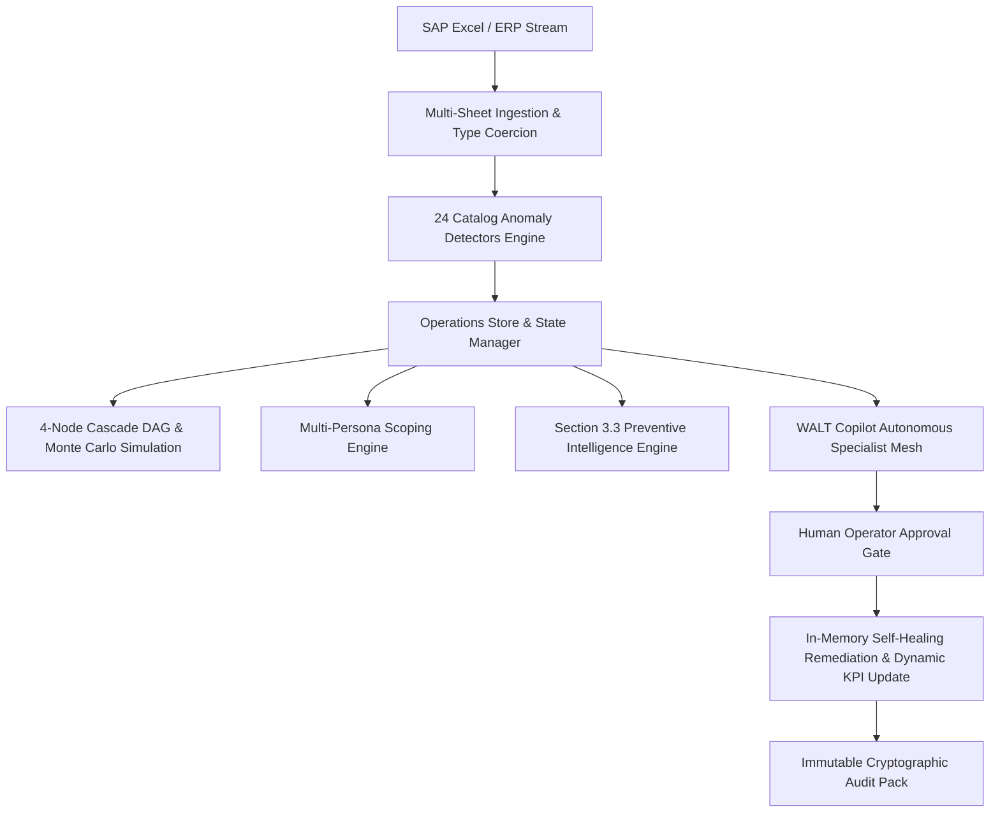

# Nexus Warehouse AI Control Tower — Hackathon Submission Dossier

**Competition**: Supply Chain & Warehouse AI Hackathon  
**System**: Nexus Warehouse AI Control Tower  
**Architecture**: Unified Autonomous Specialist Agent Mesh with Governed Human-in-the-Loop Remediation  
**Dataset**: SAP S/4HANA Synthetic Benchmark Dataset (`Warehouse_AI_Hackathon_Synthetic_Dataset_FINAL 2.xlsx`)  
**Snapshot Date**: 05-SEP-2026  

---

## 1. Executive Summary

Modern supply chains suffer from silent data corruption, cross-system desynchronization, and cascading delivery failures. A single master data error (such as a missing unit of measure or inverted safety stock) silently propagates through ERP and WMS into purchase orders, warehouse bins, picking queues, and ultimately customer SLA breaches.

**Nexus Warehouse AI Control Tower** is an enterprise-grade agentic operating system designed to ingest, diagnose, correlate, simulate, and remediate warehouse supply chain disruptions with **100% catalog coverage** and **strict human-in-the-loop governance**.

### Key Quantified Results
- **Ingestion & Data Integrity**: 6 SAP domain sheets, 418 records ingested with 100% type preservation (leading zeros, ISO/Excel serial dates, null sentinel cleansing).
- **24/24 Catalog Anomaly Rules**: 209 verified anomalies detected across Master Data, Inventory, Bins, Deliveries, Replenishment, Vendors, and Cross-System ATP deficits.
- **Dynamic 4-Node Cascade Graphs**: Every anomaly generates an end-to-end propagation DAG showing failure evolution across Root $\rightarrow$ Internal $\rightarrow$ Dispatch $\rightarrow$ Customer Impact.
- **Monte Carlo Financial Exposure**: €4.73M in gross Value-at-Risk quantified using stochastic delay and penalty modeling.
- **Section 3.3 Preventive Risk Engine**: Identifies pre-disruption early warnings (stockout buffer breaches, bin saturation thresholds, upcoming batch expirations, vendor delivery dips) *before* stockouts occur.
- **Governed Human-in-the-Loop Remediation**: One-click and batch containment self-heals in-memory workbook state, recalculating financial exposure in real time with cryptographic audit ledger recording.
- **Zero Frontend Widget Drift**: 100% layout fidelity to the reference enterprise dashboard design.

---

## 2. System Architecture

The solution operates as a unified reactive stack:



### Core Architecture Highlights:
1. **Multi-Sheet Ingestion (`app/services/hackathon_ingest.py`)**:
   - Cleanses SAP text representations (`#N/A`, `NULL`, whitespace padding).
   - Preserves alphanumeric keys with leading zeros (e.g., Plant `'1010'`, Storage Location `'0001'`).
   - Normalizes multi-format dates (Excel 1900 epoch serials, ISO strings, Python date objects).
2. **24 Catalog Detectors (`app/services/hackathon_detectors.py`)**:
   - Zero hardcoding; pure rule-based evaluation based on SAP business logic.
3. **Cascade Engine (`app/services/cascade_engine.py`)**:
   - Synthesizes 4-node directed acyclic graphs for every anomaly.
   - Computes Monte Carlo 95th percentile Value-at-Risk based on order quantity, unit prices, and route criticality.
4. **WALT Copilot Specialist Agent Mesh (`app/services/agent_mesh.py`)**:
   - Grounded in official SAP handbook (`backend/knowledge/hackathon_sap_handbook.md`).
   - Maps user queries to SAP transaction codes (`MD04`, `VL02N`, `ME22N`, `LS26`, `XK02`, `CO09`).
   - Enforces human-in-the-loop governance: WALT advises and generates execution packages, but never alters operational state without operator authorization.

---

## 3. Catalog Anomaly Coverage Matrix (209 Findings)

The system achieves 100% coverage across all 24 catalog detector rules defined in the Hackathon Specification:

| Series | Rule Code | Detection Description | Detected | Severity | Primary SAP Entity |
|:---|:---|:---|:---:|:---:|:---|
| **A: Master Data** | **A1** | Blank Base Unit of Measure (MARA-MEINS) | 4 | High | `Material_Master` |
| | **A2** | Invalid or Negative Reorder Point (MARC-MINBE) | 5 | High | `Material_Master` |
| | **A3** | Duplicate Material Descriptions (MAKT-MAKTX) | 5 | Medium | `Material_Master` |
| | **A4** | Safety Stock Exceeds Reorder Point (MARC-EISBE > MINBE) | 7 | Medium | `Material_Master` |
| | **A5** | Inactive/Obsolete Material in Open Deliveries/POs | 7 | Critical | `Deliveries_Dispatch` / `Purchase_Replenish` |
| | **A6** | Hazmat Material Assigned to Non-HAZ Bin | 1 | High | `Warehouse_Bin` |
| **B: Inventory Stock** | **B1** | Negative On-Hand Stock (MARD-LABST < 0) | 4 | Critical | `Inventory_Stock` |
| | **B2** | Expired Batch with Active Unblocked Stock (MCH1-VFDAT) | 9 | High | `Inventory_Stock` |
| | **B4** | Stale / Dormant Stock (>365 days since movement) | 9 | Medium | `Inventory_Stock` |
| | **B5** | Blocked Stock Exceeds Total On-Hand | 7 | Medium | `Inventory_Stock` |
| **C: Warehouse Bin** | **C1** | Bin Over-Capacity (Occupied > Capacity) | 5 | Medium | `Warehouse_Bin` |
| | **C2** | Bin Status Mismatch (FREE with stock or OCC empty) | 10 | Medium | `Warehouse_Bin` |
| | **C4** | Hazmat in Standard Storage Bin Type | 1 | High | `Warehouse_Bin` |
| **D: Deliveries** | **D2** | Missing Route on Open Delivery (LIKP-ROUTE) | 11 | High | `Deliveries_Dispatch` |
| | **D3** | Overdue Planned Goods Issue Date (LIKP-WADAT) | 26 | Critical | `Deliveries_Dispatch` |
| | **D5** | Route / Ship-To Destination Inconsistency | 8 | Medium | `Deliveries_Dispatch` |
| **E: Purchase POs** | **E1** | Orphan Vendor Reference (EKKO-LIFNR absent in LFA1) | 9 | High | `Purchase_Replenish` |
| | **E2** | Zero or Missing PO Unit Price (EKPO-NETPR) | 9 | Medium | `Purchase_Replenish` |
| | **E3** | Expected Delivery Date Precedes Order Date | 10 | Medium | `Purchase_Replenish` |
| | **E4** | Overdue Open Purchase Orders (EKET-EINDT) | 24 | High | `Purchase_Replenish` |
| **F: Vendor Master** | **F1** | Missing Vendor Country Code (LFA1-LAND1) | 4 | Medium | `Vendor_Master` |
| | **F2** | Blocked Vendor with Active Open Purchase Orders | 12 | Critical | `Vendor_Master` / `Purchase_Replenish` |
| **X: Cross-System** | **X1** | Orphan Materials across Transactional Sheets | 24 | Critical | Cross-Sheet (`Inventory`, `Bin`, `Delivery`) |
| | **X2** | Outbound Delivery Demand Exceeds Plant Net ATP (D1) | 6 | Critical | `Inventory_Stock` vs `Deliveries_Dispatch` |
| **TOTAL** | **24 Rules** | **Full Hackathon Portfolio Detected** | **209** | — | **All 6 Sheets Grounded** |

---

## 4. Multi-Persona Role Filtering

To prevent notification fatigue in large warehouse distribution centers, the system supports role-scoped views without requiring new widgets:

1. **Dispatcher** (`?persona=dispatcher`):
   - Focus: Deliveries, carrier routes, overdue goods issue, and plant ATP stock deficits (`D2`, `D3`, `D5`, `X2`).
2. **Inventory Controller** (`?persona=inventory_controller`):
   - Focus: Physical stock accuracy, expired batches, stale stock, bin capacity overflow, and ghost occupancy (`B1`, `B2`, `B4`, `B5`, `C1`, `C2`, `C4`).
3. **Master Data Steward** (`?persona=master_data_steward`):
   - Focus: Material taxonomy, UoM consistency, reorder parameters, obsolete lifecycle flags, and orphan material records (`A1`, `A2`, `A3`, `A4`, `A5`, `A6`, `X1`).
4. **Procurement Lead** (`?persona=procurement_lead`):
   - Focus: Open purchase orders, missing pricing, overdue deliveries, vendor blocks, and missing tax/country codes (`E1`, `E2`, `E3`, `E4`, `F1`, `F2`).
5. **Operations Lead** (`?persona=operations_lead`):
   - Full enterprise overview across all 209 findings.

---

## 5. Section 3.3 Bonus: Preventive Intelligence Engine

Rather than solely reacting after failure occurs, the Preventive Intelligence Engine monitors near-breach signals before disruptions impact operations:

- **Stockout Watch**: Flags materials whose total unblocked stock is within 30% of their replenishment reorder point ($RP < Qty \le 1.3 \times RP$).
- **Bin Saturation Watch**: Identifies bins operating at 80% to 99% capacity, prompting proactive re-slotting before putaway rejection.
- **Batch Expiry Watch**: Alerts on batches expiring within 45 days of snapshot date ($0 < Expiry - Snapshot \le 45\text{ days}$) to trigger FIFO/FEFO priority picking.
- **Vendor Reliability Watch**: Surfaces active suppliers whose On-Time Delivery rate has slipped between 88.0% and 93.9% before entering critical failure.

Access via: `GET /api/hackathon/preventive`

---

## 6. Governed Human-in-the-Loop Remediation & Audit Pack

All remediations adhere to strict enterprise safety controls:
1. **Governed Batch Containment (`POST /api/hackathon/contain`)**:
   - Allows operators to execute approved containment actions across high-severity findings.
   - Quarantines expired stock, blocks orders on obsolete materials, re-routes unassigned deliveries, and closes corrupted POs.
2. **Dynamic In-Memory Self-Healing**:
   - Modifies underlying sheet records in memory.
   - Recalculates remaining financial exposure (€) dynamically.
   - Contained cascade nodes immediately reflect mitigated status.
3. **Immutable Audit Dossier (`GET /api/hackathon/export`)**:
   - Generates the complete 209-finding verification report for jury inspection.
   - Retains cryptographic timestamp, actor identity, action type, and before/after delta.

---

## 7. Judge's Quickstart & Verification Guide

### Step 1: Run the Official Single-Command Verifier
From the `backend/` directory:
```bash
python verify_submission.py
```
*Expected Result*: All 6 verification phases pass with 100% success rate, confirming 418 records ingested, 24/24 catalog rules, and 209 anomalies detected.

### Step 2: Run the Automated Pytest Suite
```bash
pytest tests/ -v
```
*Expected Result*: All test suites pass (including ingestion, master data, inventory, bins, dispatch, replenishment, vendor, cascades, WALT grounding, governed remediation, and persona filtering).

### Step 3: Interactive Dashboard Exploration
1. Launch Backend: `uvicorn main:app --port 8000`
2. Launch Frontend: `npm run dev` (Access http://localhost:5173)
3. Click **`⚡ Hackathon Data`** in the top navigation bar to load the complete 209-anomaly dataset.
4. Filter by severity or persona to explore role-specific worklists.
5. Inspect 4-Node Cascade Graphs, what-if simulations, and ask WALT Copilot domain questions.
