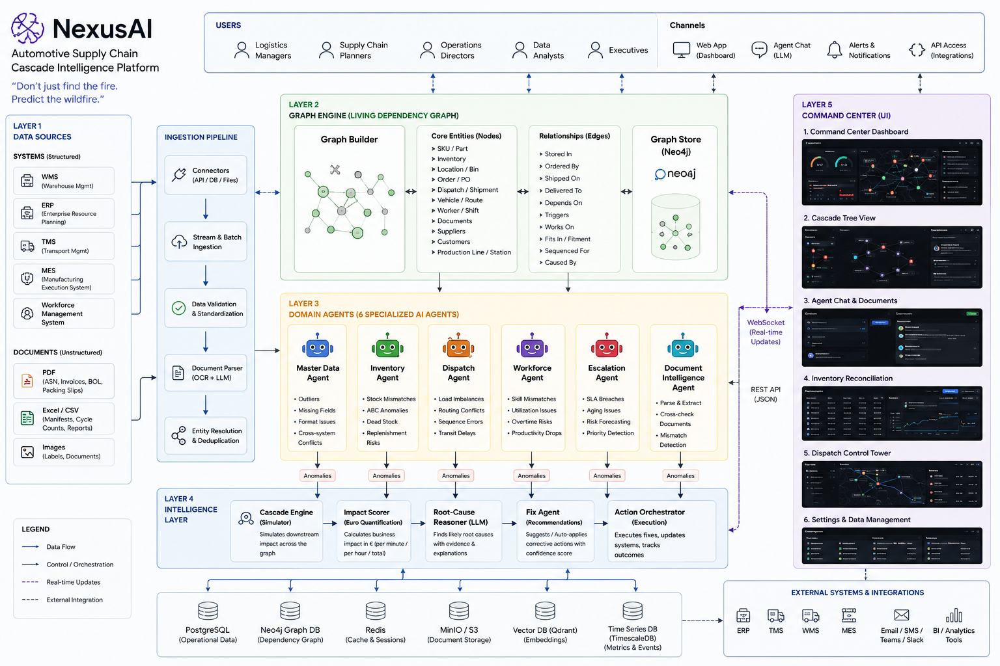
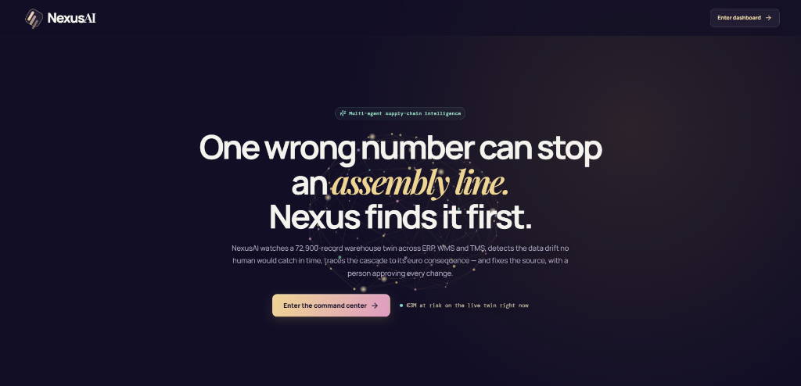
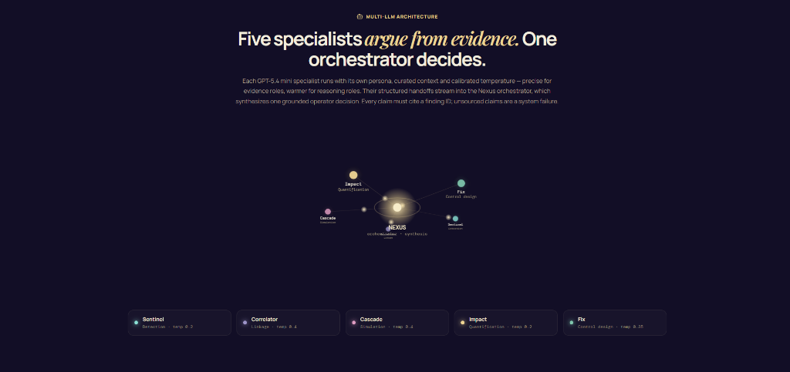
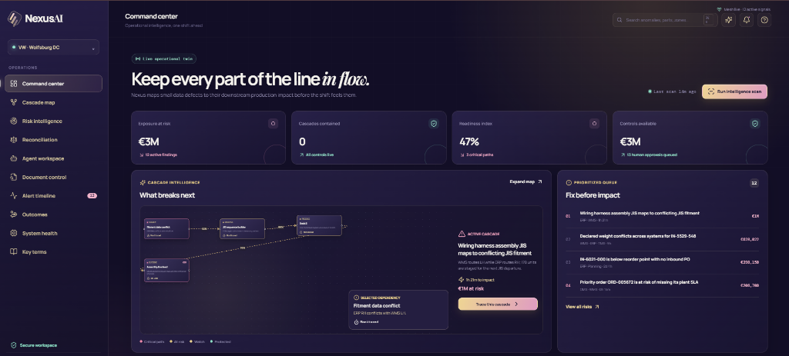
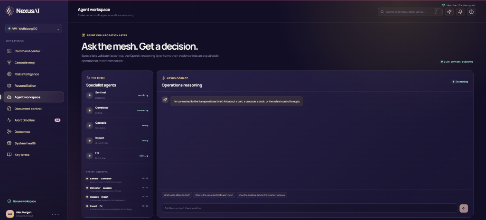
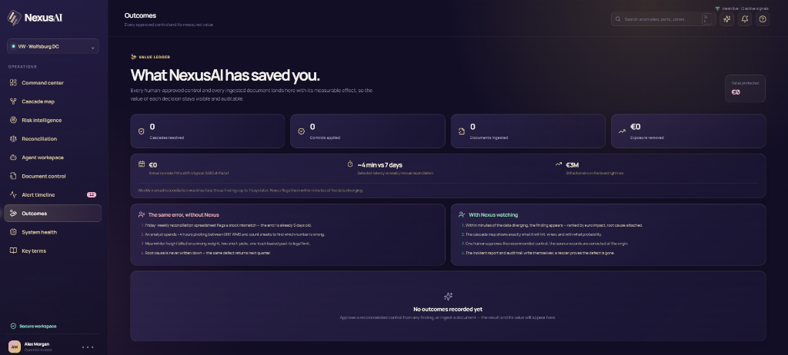
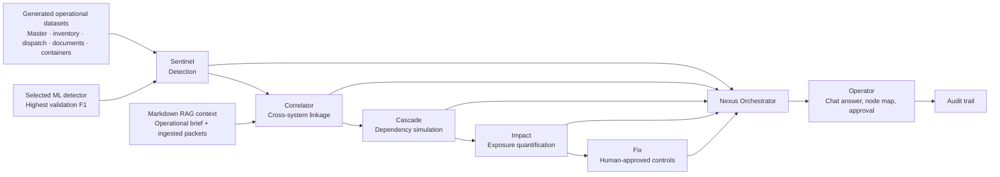

<div align="center">



# 🧠 NexusAI

### Multi-Agent Supply-Chain Cascade Intelligence Platform

[](https://python.org)
[](https://fastapi.tiangolo.com)
[](https://react.dev)
[](https://vitejs.dev)
[](https://openai.com)
[](https://scikit-learn.org)
[](https://docker.com)
[](LICENSE)

**_"Don't just find the fire. Predict the wildfire."_**

One wrong number can stop an assembly line. NexusAI watches a 72,900-record warehouse digital twin across ERP, WMS, and TMS — detects the data drift no human would catch in time, traces the cascade to its euro consequence, and fixes the source with a human approving every change.

<br />

[🚀 Quick Start](#-quick-start) · [🏛 Architecture](#-architecture) · [✨ Features](#-what-nexusai-does) · [🌐 API Reference](#-api-reference-30-endpoints) · [🔄 Closed Loop](#-the-closed-loop-why-this-demo-is-different) · [🎬 Demo Playbook](#-demo-playbook) · [✅ Testing](#-testing--verification-26-tests) · [📁 Project Structure](#-project-structure)

---

</div>

<br />

## 📸 Screenshots

<table>
  <tr>
    <td width="50%">
      
      <p align="center"><b>Landing Page</b> — 3D animated cascade network, live exposure figure</p>
    </td>
    <td width="50%">
      
      <p align="center"><b>Multi-LLM Architecture</b> — Five specialists argue from evidence</p>
    </td>
  </tr>
  <tr>
    <td width="50%">
      
      <p align="center"><b>Command Center</b> — Exposure, cascades, readiness, impact-ranked queue</p>
    </td>
    <td width="50%">
      
      <p align="center"><b>Agent Workspace</b> — Streaming chat with the mesh, per-specialist handoffs</p>
    </td>
  </tr>
  <tr>
    <td colspan="2">
      
      <p align="center"><b>Outcomes</b> — Value ledger: every approved control with its measurable effect</p>
    </td>
  </tr>
</table>

<br />

---

## 🎯 The Problem

Warehouse and logistics operations depend on correct master data and accurate inventory signals across many systems — ERP, WMS, TMS, planning, quality, execution. In practice those records drift: fragmented, outdated, inconsistent. The result is dispatch delays, misrouting, stock mismatches, replenishment failures, wasted manual effort, poor workforce planning, and escalations that could have been prevented days earlier.

The insidious part: **each system looks healthy on its own.** WMS says 542. ERP says 498. Both are confident. Someone is wrong — and by the time a weekly reconciliation notices, the error has already been billed, picked, loaded, and shipped.

---

## 💡 The Answer

NexusAI is a **multi-agent intelligence mesh** watching a 72,900-record operational twin of an automotive distribution center (VW · Wolfsburg DC). It:

1. **Detects** data drift autonomously — 20+ statistical, rule-based and ML checks, no manual tagging
2. **Traces** every finding through a dependency graph to its downstream consequence, with a modeled probability on every hop
3. **Quantifies** the damage in euros via Monte-Carlo simulation — expected exposure, P90 tail risk, and the counterfactual value of every proposed fix
4. **Recommends** corrective controls — and on human approval, **genuinely corrects the source records**, so a rescan proves the defect is gone
5. **Accounts** for every decision in an auditable value ledger that reconciles to the euro

---

## 🏛 Architecture



**Layered design:** structured sources (WMS/ERP/TMS/workforce) and unstructured documents (PDF, Excel/CSV, images) feed an ingestion pipeline → a living dependency graph over parts, inventory, orders, dispatches, workers and documents → **six domain AI agents** emit anomalies → an intelligence layer (cascade simulator, euro impact scorer, LLM root-cause reasoner, fix recommender, action orchestrator) → the command-center UI, live over WebSocket.

### The Multi-LLM Mesh

Every chat question fans out to **five GPT-5.4-mini specialists in parallel**, each with its own persona, role-curated retrieval context, and calibrated temperature:

| Specialist | Role | Temperature | Why |
|---|---|---|---|
| **Sentinel** | Detection | 0.2 | Evidence-bound precision |
| **Correlator** | Cross-system linkage | 0.4 | Connects dots — causal vs correlated vs coincidental |
| **Cascade** | Propagation simulation | 0.4 | Models paths and containment points |
| **Impact** | Euro quantification | 0.2 | Copies figures exactly, never estimates |
| **Fix** | Control design | 0.35 | Sequences safety-critical actions first |

A **Nexus orchestrator** synthesizes their structured handoffs into one operator decision. Hard grounding rules throughout: *every claim must cite a finding ID; unsourced claims are a system failure; no action is ever claimed as executed — humans approve everything.* With no API key, a deterministic evidence layer answers instead, so the demo never breaks.

### The Measured ML

Three sklearn classifiers (extra trees, random forest, hist gradient boosting) train on the same temporal holdout; **the best F1 goes live** and scores all 15,000 inventory positions. F1 over accuracy because faults are rare — a model calling everything "normal" would score 99% accuracy and catch nothing. Detection is two-factor: a finding needs a real quantity spread **and** a model score ≥ .5, so statistical noise never pages an operator. The full benchmark (all candidates, all metrics) is exposed on the **System health** page.

---

## ✨ What NexusAI Does

### Detection — 12 Finding Types, Zero Manual Tagging

| Finding | Systems | How it's caught |
|---|---|---|
| JIS fitment conflict | ERP · WMS | Cross-system variant comparison |
| Weight conflict | WMS · ERP · TMS | >10% cross-system variance |
| Inventory divergence | WMS · ERP · Count | Spread ≥ 25 EA **+** ML score ≥ .5 |
| Missing PPAP evidence | QMS · WMS | Document completeness check |
| Supplier lead-time drift | ERP · Receipts | Configured vs observed ≥ 3 days |
| VDA label failures | TMS · Print service | Verification count vs total |
| Vehicle overload | TMS · Load planner | Load vs approved capacity |
| Workforce productivity drop | Workforce · WMS | 7-day vs 60-day baseline + overtime |
| SLA breach risk | OMS · WMS | Predicted before the deadline passes |
| Hazmat flag conflict | ERP · WMS | Storage class vs handling flag logic |
| Overdue KLT containers | Container ledger | Return-scan window exceeded |
| **Replenishment gap** | ERP · Planning | Stock ≤ reorder point with **no covering PO** |

### The Command Center — 11 Surfaces

| Page | Description |
|---|---|
| **Landing page** | 3D animated cascade network, live exposure figure, animated multi-LLM orbital + ML benchmark sections |
| **Command center** | Exposure at risk, cascades contained, readiness index, controls available; live cascade panel and impact-ranked queue |
| **Cascade map** | Draggable dependency graph, Monte-Carlo ribbon (1,000 trials), **what-if simulation**, **LLM-narrated cascade explanation** streamed live |
| **Risk intelligence** | Filterable decision queue with a **Contained** tab showing removed exposure |
| **Reconciliation** | WMS vs ERP vs physical truth workbench with drift timeline |
| **Agent workspace** | Streaming chat with the mesh; per-specialist handoff trace, markdown rendering, follow-up suggestions |
| **Document control** | Drag-and-drop ingestion (PDF/CSV/XLSX/images), extraction, cross-checking, release-gap flagging |
| **Alert timeline** | Deadline-ordered risks; escalation previews behind the notification bell |
| **Outcomes** | The value ledger: every approved control and ingested document with euros protected, ROI band |
| **System health** | Detector benchmark, live endpoint latency probes, score distribution, runtime facts |
| **Key terms** | 27-term domain glossary (JIS, PPAP, VDA, KLT, Monte-Carlo…), searchable |

### Presenter Console

The ❓ button opens a 7-beat, 90-second **demo tour** that navigates the app as you present — with three live controls:

| Control | Shortcut | What it does |
|---|---|---|
| ⚡ **Incident** | `Ctrl+Shift+I` | Breaks one healthy record at runtime; the next scan *discovers* it |
| 🌩 **Storm** | — | 3+ simultaneous incidents; watch the queue triage a bad shift by euros |
| ↺ **Reset** | — | Two-click regeneration of the entire twin and ledger, ~3 seconds, no restart |

---

## 🔄 The Closed Loop (Why This Demo is Different)

Most anomaly-detection demos stop at "look, a red flag." NexusAI closes the loop, verifiably:

```
detect  →  trace  →  quantify  →  human approves  →  SOURCE DATA CORRECTED  →  rescan stays clean
```

- Applying a fix **mutates the twin**: weights republished, journals rebuilt to physical truth, PPAP attached, loads split, an **actual expedited PO record created** for replenishment gaps
- The finding resolves; exposure drops by exactly its impact; containment ticks up; readiness rises
- A rescan runs the same detectors on the corrected data — **the defect does not come back**
- The accounting reconciles to the euro, enforced by test:
  **`exposure at risk + value protected = the board's total exposure`**

And because incidents can be **injected live**, judges can watch a defect be born, discovered, priced, fixed, and proven gone — in one sitting. Nothing is scripted; findings are discovered.

Every state change is audited (who, what, when, before/after), and any finding exports a **post-incident report** (markdown) with evidence, cascade model, approvals, and measured outcome — the artifact a real company would file.

---

## 🚀 Quick Start

### Prerequisites

| Requirement | Version | Required |
|---|---|---|
| **Python** | 3.11+ | ✅ Yes |
| **Node.js** | 18+ | ✅ Yes |
| **npm** | 9+ | ✅ Yes (comes with Node) |
| **Docker** | 20+ | ❌ Optional (for containerized setup) |
| **OpenAI API Key** | — | ❌ Optional (demo works without it) |

---

### Option 1: Local Development (Recommended)

#### Step 1 — Clone the repository

```bash
git clone https://github.com/yourusername/nexus-ai.git
cd nexus-ai
```

#### Step 2 — Start the Backend

<details>
<summary><b>🪟 Windows (PowerShell)</b></summary>

```powershell
cd backend

# Create and activate virtual environment
python -m venv .nexus-env
.nexus-env\Scripts\Activate.ps1

# Install dependencies
pip install -r requirements.txt

# Configure environment (optional: add your OpenAI key)
copy .env.example .env
# Edit .env → set OPENAI_API_KEY=sk-... (optional)

# Start the server
python -m uvicorn main:app --port 8000 --reload
```

</details>

<details>
<summary><b>🍎 macOS / 🐧 Linux</b></summary>

```bash
cd backend

# Create and activate virtual environment
python3 -m venv .nexus-env
source .nexus-env/bin/activate

# Install dependencies
pip install -r requirements.txt

# Configure environment (optional: add your OpenAI key)
cp .env.example .env
# Edit .env → set OPENAI_API_KEY=sk-... (optional)

# Start the server
python -m uvicorn main:app --port 8000 --reload
```

</details>

> **First boot** generates the full 72,900-record operational twin and trains the ML benchmark (~15 seconds). Every boot after reloads persisted scores in ~3 seconds.

#### Step 3 — Start the Frontend (new terminal)

```bash
cd frontend
npm install
npm run dev
```

#### Step 4 — Open the App

| Resource | URL |
|---|---|
| 🖥 **NexusAI App** | [http://localhost:5173](http://localhost:5173) |
| 📖 **API Docs (Swagger)** | [http://localhost:8000/docs](http://localhost:8000/docs) |
| 📖 **API Docs (ReDoc)** | [http://localhost:8000/redoc](http://localhost:8000/redoc) |

Navigate to the landing page → click *"Enter the command center"* → explore.

---

### Option 2: Docker Compose (One Command)

```bash
docker compose up --build
```

This starts **4 services** automatically:

| Service | Description | Port |
|---|---|---|
| `frontend` | React 19 + Vite (nginx) | `5173` |
| `backend` | FastAPI + Uvicorn | `8000` |
| `db` | PostgreSQL 16 Alpine | `5432` |
| `redis` | Redis 7 Alpine | `6379` |

Open [http://localhost:5173](http://localhost:5173) after all services are healthy.

---

### Environment Variables

All configuration is in `backend/.env`. The API key **never reaches the browser** — it stays server-side only.

| Variable | Default | Description |
|---|---|---|
| `OPENAI_API_KEY` | *(empty)* | OpenAI API key. Without it, chat and cascade narration use a deterministic evidence layer (clearly labeled "evidence mode") |
| `OPENAI_MODEL` | `gpt-5.4-mini` | Locked to `gpt-5.4-mini` by design — the validator rejects any other model |
| `FRONTEND_URL` | `http://localhost:5173` | CORS origin for the frontend |
| `DEMO_MODE` | `true` | Enables synthetic data generation |
| `DEMO_SEED` | *(empty)* | Set a number to reproduce the same synthetic operation; omit for fresh data each boot |
| `DATABASE_URL` | `sqlite:///./nexus.db` | SQLite locally; Postgres via Docker (`postgresql+psycopg://...`) |
| `REDIS_URL` | `redis://localhost:6379/0` | Redis connection for real-time event bus |
| `UPLOADS_DIR` | `./uploads` | Directory for uploaded documents |

---

### Reset Demo State

| Method | Command |
|---|---|
| **In-app** | Click the ↺ Reset button in the presenter console (~3 seconds, no restart) |
| **API** | `POST /api/demo/reset` |
| **CLI (Windows)** | `reset_demo.bat` |
| **CLI (macOS/Linux)** | `./reset_demo.sh` |
| **Regenerate demo documents** | `python backend/scripts/generate_demo_documents.py` |

---

## 🌐 API Reference (33 Endpoints)

Full interactive documentation is auto-generated at [`/docs`](http://localhost:8000/docs) (Swagger UI) and [`/redoc`](http://localhost:8000/redoc) (ReDoc).

### Health & System

| Method | Endpoint | Description |
|---|---|---|
| `GET` | `/api/health` | Health check — returns status, timestamp, mode (`openai` or `demo`) |
| `GET` | `/api/system` | System health — detector benchmark, live endpoint latency probes, ML model metadata, score distribution |

### Dashboard & Operations

| Method | Endpoint | Description |
|---|---|---|
| `GET` | `/api/dashboard` | Main dashboard metrics — exposure at risk, cascades contained, readiness index, controls available, severity counts, agent statuses |
| `POST` | `/api/scan` | Run an intelligence scan — re-executes all 12 detectors on the current twin state |

### Anomalies (Findings)

| Method | Endpoint | Description |
|---|---|---|
| `GET` | `/api/anomalies` | List all findings — supports `?severity=`, `?status=`, `?search=` filters; results sorted by euro impact (desc) |
| `GET` | `/api/anomalies/{id}` | Get finding detail — full evidence, cascade nodes/edges, recommended actions |
| `GET` | `/api/anomalies/{id}/report` | Download incident report as markdown — evidence, cascade, approvals, measured outcome |
| `POST` | `/api/anomalies/{id}/actions/{id}/apply` | Apply a corrective control — mutates source data, writes audit trail, resolves the finding when all controls are applied |

### Cascades

| Method | Endpoint | Description |
|---|---|---|
| `GET` | `/api/cascades` | Get cascade graph — supports `?anomaly_id=` filter; returns nodes, edges, Monte-Carlo simulation results |
| `GET` | `/api/cascades/{id}/whatif/{action_id}` | What-if simulation — compares baseline vs mitigated cascade (expected impact, P90, propagation probability) |
| `POST` | `/api/cascades/{id}/explain` | Stream cascade explanation (SSE) — LLM-narrated cascade explanation with real-time token streaming |

### Agent Mesh & Chat

| Method | Endpoint | Description |
|---|---|---|
| `GET` | `/api/agents` | Get agent statuses and latest inter-agent communications |
| `GET` | `/api/agents/architecture` | Get mesh architecture — model name, specialist configs (roles, temperatures, personas) |
| `POST` | `/api/chat` | Send a question to the mesh — returns synthesized answer with agent trace (all 5 specialists + orchestrator) |
| `POST` | `/api/chat/stream` | Stream chat response (SSE) — real-time `trace`, `delta`, and `done` events |

### Documents

| Method | Endpoint | Description |
|---|---|---|
| `GET` | `/api/documents` | List all documents — source records and ingested uploads with summary stats |
| `GET` | `/api/documents/{id}` | Get document detail — metadata, status, extraction results, mismatches |
| `GET` | `/api/documents/{id}/preview` | Get document preview image (PNG) |
| `POST` | `/api/documents/inspect` | Upload and inspect a document (PDF/CSV/XLSX/images, max 5 MB) — extracts, indexes, cross-checks against the twin |

### Reconciliation & Alerts

| Method | Endpoint | Description |
|---|---|---|
| `GET` | `/api/reconciliation` | WMS vs ERP vs physical truth workbench — rows, variance summary, drift timeline |
| `GET` | `/api/alerts` | Deadline-ordered risk alerts |
| `GET` | `/api/escalations` | Escalation previews — the Slack/Teams messages that *would* fire for critical/high open findings |

### Outcomes & Audit

| Method | Endpoint | Description |
|---|---|---|
| `GET` | `/api/outcomes` | Value ledger — fixes applied, value protected, anomalies resolved, documents ingested |
| `GET` | `/api/audit` | Full audit trail — every state change with actor, event, timestamp, before/after |
| `GET` | `/api/actions` | List corrective actions — supports `?status=` filter (`recommended`, `applied`) |

### Data Browser (Paginated)

| Method | Endpoint | Description |
|---|---|---|
| `GET` | `/api/data/master-skus` | Browse master SKU records — `?page=` & `?page_size=` |
| `GET` | `/api/data/inventory` | Browse inventory positions |
| `GET` | `/api/dispatch/readiness` | Browse dispatch schedules |
| `GET` | `/api/data/{entity}` | Browse any entity: `suppliers`, `inbound-orders`, `outbound-orders`, `dispatches`, `workforce`, `containers` |

### Demo Controls

| Method | Endpoint | Description |
|---|---|---|
| `POST` | `/api/demo/inject` | Inject a live incident — `?type=` one of: `weight`, `overload`, `inventory`, `jis`, `hazmat`, `leadtime`, `vda`, `workforce`, `sla`, `klt`, `ppap`, `replenishment`, or `random` |
| `POST` | `/api/demo/storm` | Inject multiple simultaneous incidents — `?count=` (1–5, default 3) |
| `POST` | `/api/demo/reset` | Full twin regeneration — fresh dataset, empty ledgers, ~3 seconds |

### WebSocket (Real-Time)

| Protocol | Endpoint | Description |
|---|---|---|
| `WS` | `/ws/operations` | Live operational pulse — pushes `pulse` events every 5 seconds + `action_applied`, `scan_complete`, `document_ingested` events |

---

## 🎬 Demo Playbook

The in-app tour (❓) walks these beats with speaker lines:

| Beat | What Happens |
|---|---|
| **1. Open on the money** | €2.9M exposure, 12 live findings, four-metric story: threat → track record → health → opportunity |
| **2. Show one cascade** | The JIS fitment conflict: 93% → 88% → 76% hop probabilities into the line |
| **3. Run the counterfactual** | What-if panel prices the fix before committing; "Explain this cascade" narrates the graph |
| **4. Ask the mesh** | Five specialists cite finding IDs; open the handoff trace |
| **5. Approve as the human** | Apply controls; the source data is genuinely corrected |
| **6. Show the drop** | Exposure falls by the exact impact; rescan; the finding stays gone |
| **7. Close on value** | The Outcomes ledger: euros protected, annual run-rate, minutes vs days |

> 💡 **Pro tip:** Hit **Storm** and let the judges watch triage happen in real time.

---

## ✅ Testing & Verification (26 Tests)

```bash
# Run the full backend test suite
cd backend && python -m pytest tests/ -v

# Lint and build the frontend
cd frontend && npm run lint && npm run build
```

### Test Coverage Map

| Category | Tests | What's Verified |
|---|---|---|
| **Core reads** | 5 | Health, dashboard, anomaly filters, cascade graph data, reconciliation consistency |
| **State transitions** | 4 | Action apply → status change → audit write → resolution → rescan stays clean |
| **Live incidents** | 4 | Inject, fix, storm injection, demo reset regeneration |
| **Value ledger** | 2 | `exposure_at_risk + value_protected = total_exposure` accounting invariant, scan preserves applied status |
| **Chat mesh** | 4 | Deterministic fallback, stream events (trace/delta/done), payload validation, empty board resilience |
| **Documents** | 4 | Listing, upload inspection with flag detection, oversize rejection (>5 MB), preview 404 handling |
| **Replenishment** | 1 | Gap detection → PO creation → resolution → rescan confirmation |
| **Reports** | 1 | Markdown incident report with required sections |
| **Persistence** | 1 | ML scores survive restart (no retraining on reload) |

### The Accounting Invariant

The most important test enforces a mathematical identity across the entire system:

```python
exposure_at_risk + value_protected == board_total_exposure
```

If the dashboard and the outcomes ledger ever disagree by even €1, the test fails. This ensures NexusAI can't silently lose or invent money.

---

## 📁 Project Structure

```
nexus-ai/
├── backend/
│   ├── app/
│   │   ├── config.py              # Pydantic settings (env-driven)
│   │   ├── db.py                  # SQLAlchemy models & repository
│   │   ├── models.py              # Pydantic request/response schemas
│   │   └── services/
│   │       ├── agent_mesh.py      # 5-specialist LLM mesh + deterministic fallback
│   │       ├── cascade_engine.py  # NetworkX dependency graph + Monte-Carlo simulation
│   │       ├── document_parser.py # PDF/CSV/XLSX/image ingestion & cross-checking
│   │       ├── event_bus.py       # Redis pub/sub + WebSocket broadcaster
│   │       ├── knowledge_base.py  # Markdown RAG context retrieval
│   │       ├── ml_detection.py    # 3-model benchmark (ExtraTrees/RF/HGB), F1 selection
│   │       ├── operations.py      # Core operations store (48KB of domain logic)
│   │       ├── reasoner.py        # Chat orchestration & cascade explanation streaming
│   │       └── seed.py            # 72,900-record synthetic data generator
│   ├── datasets/                  # Generated operational datasets
│   ├── knowledge/                 # Operational briefs & ingested document contexts
│   ├── scripts/                   # Utility scripts (demo document generation)
│   ├── tests/
│   │   ├── conftest.py            # Test configuration
│   │   └── test_api.py            # 26 integration tests
│   ├── main.py                    # FastAPI app with 30 endpoints
│   ├── requirements.txt           # Python dependencies (18 packages)
│   └── Dockerfile
├── frontend/
│   ├── src/
│   │   ├── pages/                 # 11 page components
│   │   │   ├── Landing.jsx        # 3D animated landing with orbital LLM visualization
│   │   │   ├── CommandCenter.jsx  # Main operational dashboard
│   │   │   ├── CascadeMap.jsx     # Interactive dependency graph + what-if
│   │   │   ├── RiskIntelligence.jsx
│   │   │   ├── Reconciliation.jsx
│   │   │   ├── AgentWorkspace.jsx # Streaming chat with specialist mesh
│   │   │   ├── Documents.jsx      # Drag-and-drop document ingestion
│   │   │   ├── AlertsTimeline.jsx
│   │   │   ├── Outcomes.jsx       # Value ledger
│   │   │   ├── SystemHealth.jsx   # ML benchmark + endpoint probes
│   │   │   └── KeyTerms.jsx       # Domain glossary
│   │   ├── components/            # 10 shared components
│   │   │   ├── CascadeGraph.jsx   # @xyflow/react dependency graph
│   │   │   ├── DemoTour.jsx       # 7-beat presenter console
│   │   │   ├── EscalationPanel.jsx
│   │   │   ├── Markdown.jsx       # Markdown renderer
│   │   │   ├── MetricCard.jsx
│   │   │   ├── Sidebar.jsx
│   │   │   └── ...
│   │   ├── api.js                 # API client (fetch + SSE streaming)
│   │   ├── App.jsx                # Router + layout
│   │   ├── styles.css             # 72KB design system
│   │   └── main.jsx               # Entry point
│   ├── package.json
│   ├── vite.config.js
│   └── Dockerfile
├── demo_documents/                # Sample PDFs and CSVs for drag-and-drop testing
│   ├── asn_clean_with_ppap.pdf
│   ├── cycle_count_sheet.csv
│   ├── delivery_note_missing_ppap.pdf
│   └── invoice_hazmat_sku.pdf
├── docs/
│   └── assets/                    # Architecture diagram and screenshots
├── docker-compose.yml             # Full stack: frontend + backend + PostgreSQL + Redis
├── reset_demo.bat                 # Windows demo reset
├── reset_demo.sh                  # macOS/Linux demo reset
└── README.md
```

---

## 🛠 Tech Stack

### Backend

| Technology | Purpose |
|---|---|
| **FastAPI** ≥0.115 | Async REST API + WebSocket + SSE streaming |
| **Uvicorn** | ASGI server |
| **Pydantic** ≥2.8 | Request/response validation + settings management |
| **SQLAlchemy** ≥2.0 | ORM — SQLite (local) / PostgreSQL (Docker) |
| **scikit-learn** ≥1.5 | ML anomaly detection (ExtraTrees, RandomForest, HistGradientBoosting) |
| **NetworkX** ≥3.2 | Dependency graph + cascade simulation |
| **NumPy** ≥1.26 | Numerical operations |
| **OpenAI SDK** ≥1.0 | GPT-5.4-mini Responses API |
| **Redis** ≥5.0 | Real-time event bus (pub/sub) |
| **PyPDF + PyMuPDF** | PDF parsing and extraction |
| **Pillow** ≥10.0 | Image processing |
| **openpyxl** ≥3.1 | Excel/XLSX parsing |
| **httpx** ≥0.27 | Async HTTP client (testing) |
| **pytest** ≥8.0 | Test framework |

### Frontend

| Technology | Purpose |
|---|---|
| **React** 19 | UI framework |
| **Vite** 6 | Build tool + dev server |
| **@xyflow/react** 12.8 | Interactive dependency graph visualization |
| **Framer Motion** 12.23 | Animations + transitions |
| **Lucide React** | Icon library |
| **Recharts** 2.15 | Charts + data visualization |
| Custom Canvas 3D | Landing page orbital animation (no heavy 3D dependency) |

### Infrastructure

| Technology | Purpose |
|---|---|
| **Docker Compose** | Multi-service orchestration |
| **PostgreSQL** 16 Alpine | Production database |
| **Redis** 7 Alpine | Event streaming + pub/sub |
| **nginx** | Frontend static file serving (Docker) |

---

## 🧭 Design Principles

| Principle | Enforcement |
|---|---|
| **Human-controlled operations** | The AI recommends and prepares; a person approves every state change. The approval click *is* the sign-off; the audit trail is the proof. |
| **Grounded intelligence** | Specialists may only cite provided evidence. Numbers are copied, never invented. Unsourced claims are a system failure. |
| **Honest metrics** | The dashboard and the ledger are two views of one accounting identity, enforced by test (`exposure + protected = total`). |
| **Provably live** | Inject an incident. Watch it get caught. That's the whole point. |
| **Graceful degradation** | Without an OpenAI API key, the entire product still works — chat and cascade narration answer from the deterministic evidence layer, clearly labeled "evidence mode." |

---

## 🤝 Contributing

1. Fork the repository
2. Create your feature branch (`git checkout -b feature/amazing-feature`)
3. Run the test suite to ensure everything passes:
   ```bash
   cd backend && python -m pytest tests/ -v
   cd frontend && npm run lint && npm run build
   ```
4. Commit your changes (`git commit -m 'Add amazing feature'`)
5. Push to the branch (`git push origin feature/amazing-feature`)
6. Open a Pull Request

---

## 📄 License

This project is licensed under the MIT License — see the [LICENSE](LICENSE) file for details.

---

<div align="center">

**NexusAI** · VW Wolfsburg DC operational twin · Multi-agent supply-chain cascade intelligence

Built with ❤️ for the Warehouse AI Hackathon

---

*If the dashboard and the ledger disagree by even €1, the test fails. That's the standard.*

</div>
