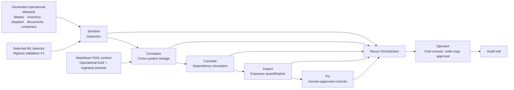

# NexusAI multi-agent architecture

NexusAI uses a specialist-agent mesh with one explicit orchestration boundary. Every model
call uses OpenAI `gpt-5.4-mini`; no other LLM provider or model family is configured.

## Runtime contract

1. Deterministic agents create verified findings from the generated source records.
2. Markdown retrieval selects relevant operational and ingested-document context.
3. With `OPENAI_API_KEY` configured, all five GPT-5.4 mini specialists run in parallel.
4. The Nexus Orchestrator makes one GPT-5.4 mini synthesis call and returns agent handoffs.
5. A human operator must approve state-changing controls. Agent responses cannot alter source
   data directly.

Without a configured key, the same specialist roles return evidence-bound deterministic
handoffs. This preserves a complete demo while never silently substituting another LLM.

